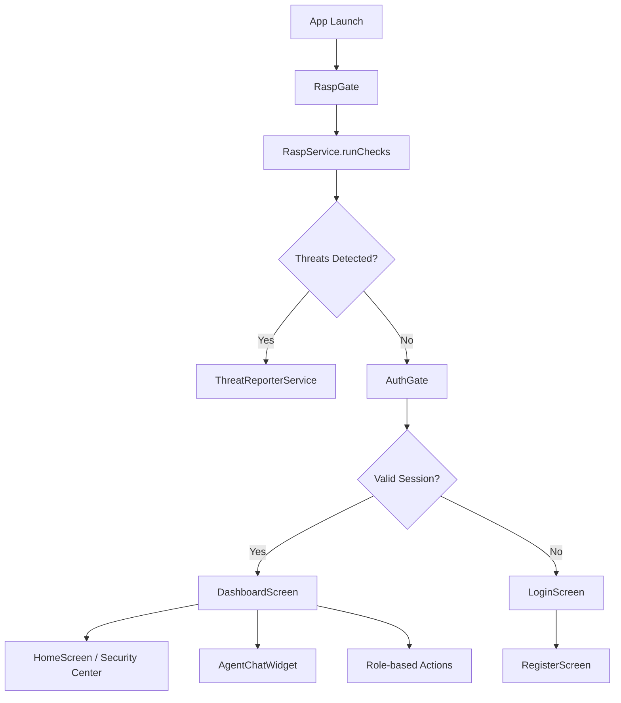
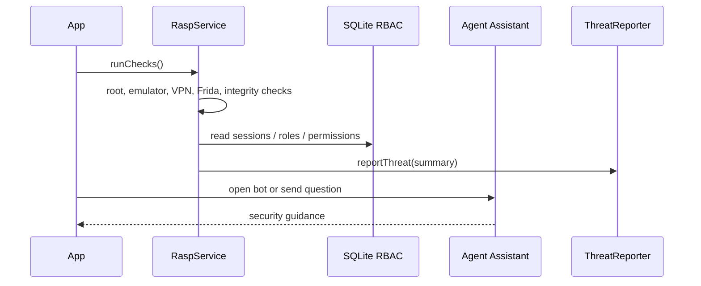
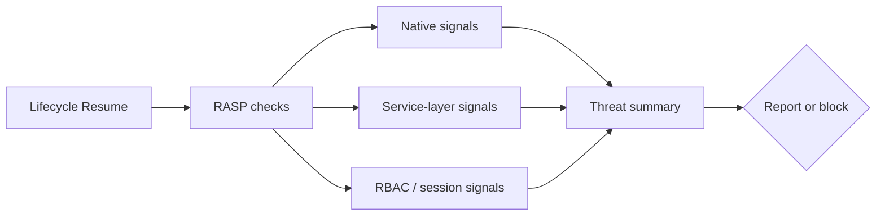

# Runtime Application and Self Protection SDK

Enterprise Flutter reference implementation for runtime application self-protection, role-based access control, secure session handling, and AI-assisted security guidance.

## Project Overview

This repository contains a production-oriented RASP stack built on Flutter:

- A runtime security layer in `lib/rasp` and `lib/services`
- A role-aware authentication and dashboard flow in `lib/screens`
- Local RBAC persistence in `lib/database`
- An interactive security assistant in `lib/ai_agent`

The codebase is designed for banking, fintech, cybersecurity, and internal enterprise deployments where runtime integrity and operational visibility matter.

## Features

- Root and jailbreak detection
- Emulator and simulator detection
- Frida detection
- VPN detection
- Proxy and MITM risk detection
- Developer mode and USB debugging signals
- App integrity and signature verification
- Repackaging detection
- Overlay and accessibility abuse detection
- Screenshot restriction and detection
- Device fingerprinting and binding checks
- Offline compliance monitoring
- Threat reporting to Firestore
- RBAC login, verification, role upgrades, and audit logs
- AI helper for security explanations and contextual guidance

## RASP Capabilities

| Capability | Implementation |
| --- | --- |
| Root / jailbreak | `safe_device` checks |
| Emulator detection | `safe_device` real-device validation |
| Frida detection | Native MethodChannel hook |
| VPN detection | Native MethodChannel hook |
| Proxy / MITM | `SslPinningService.isMitmDetected()` |
| Developer mode / USB debugging | Device fingerprint and native channel checks |
| Integrity verification | App tamper and signature checks |
| Signature verification | Native MethodChannel hook |
| Repackaging detection | Signature and integrity checks |
| Runtime monitoring | `RaspService.runChecks()` plus threat reporting |
| AI-based assistance | `AgentChatWidget` and `AgentChatController` |

## Architecture





See the full architecture notes in [docs/ARCHITECTURE.md](docs/ARCHITECTURE.md).

## Screenshots

Add or update the latest product preview here:

- `assets/image/preview.webp`

If you are publishing a release, capture updated screenshots of:

- Login
- Registration
- RBAC dashboard
- Security center
- Bot assistant

## Installation

1. Install Flutter and ensure your SDK matches the constraint in `pubspec.yaml`.
2. Clone the repository.
3. Run `flutter pub get`.
4. Configure any platform-native security hooks required by your target platform.
5. For threat reporting, add Firebase configuration if you want Firestore ingestion.

Detailed setup is documented in [docs/INSTALLATION.md](docs/INSTALLATION.md).

## Quick Start

```bash
flutter pub get
flutter run
```

Build a release APK:

```bash
flutter build apk --release
```

## SDK Integration

```dart
final result = await RaspService.runChecks();

if (result.shouldBlockApp) {
  // Show a blocked or deceptive screen
  return;
}

if (result.isThreatDetected) {
  // Surface a warning banner, log telemetry, or route to review flow
}
```

```dart
ScreenshotRestriction.setScreenshotDetectedCallback(() {
  // React to screenshot attempts in your UX or telemetry pipeline.
});
```

```dart
AgentChatWidget(deviceId: userId.toString())
```

More examples are in [docs/USAGE.md](docs/USAGE.md).

## Threat Detection Flow



## API Reference

Core references:

- [docs/API_REFERENCE.md](docs/API_REFERENCE.md)
- [docs/MIGRATION_GUIDE.md](docs/MIGRATION_GUIDE.md)
- [docs/FEATURE_COMPARISON.md](docs/FEATURE_COMPARISON.md)
- [docs/RELEASE_NOTES.md](docs/RELEASE_NOTES.md)

## Roadmap

- Expand native hook coverage for additional rooted and tamper states
- Add configurable policy profiles for fintech and enterprise deployments
- Add stronger telemetry export controls
- Add test fixtures for each threat scenario
- Add an operator dashboard for alert review and case management

## Security Considerations

- Treat device checks as risk signals, not absolute truth.
- Pair runtime protection with server-side authorization.
- Keep Firebase and native channel configuration aligned across platforms.
- Do not hard-code production secrets in the app.
- Review threat reporting policies before enabling collection in regulated environments.

## Release Notes

Current release notes and upgrade guidance are available in:

- [CHANGELOG.md](CHANGELOG.md)
- [docs/RELEASE_NOTES.md](docs/RELEASE_NOTES.md)

## License

No license file is currently declared in this repository. Add one before public redistribution.
