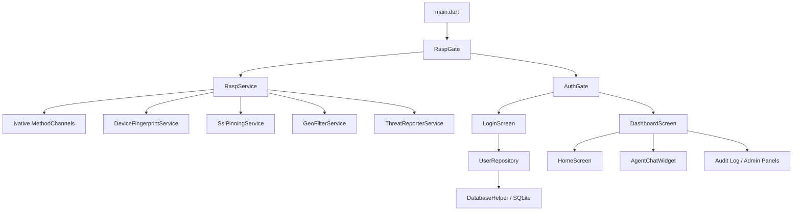
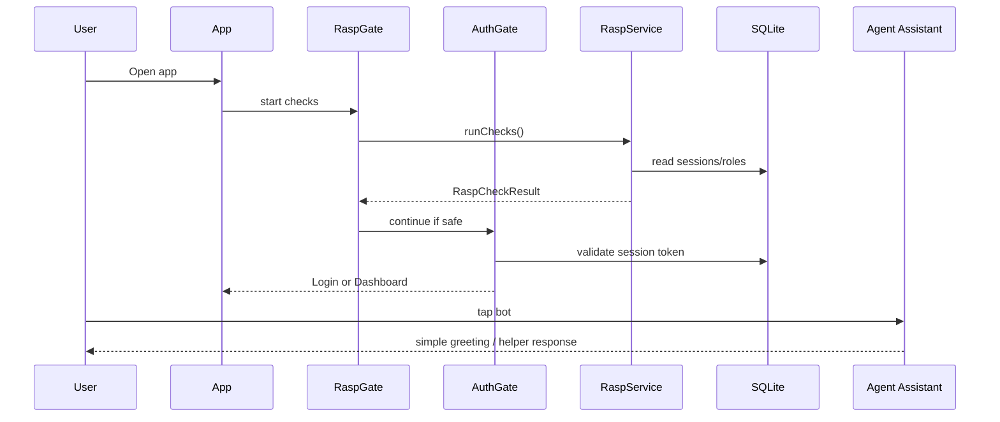

# Architecture

## Overview

The application is split into five layers:

1. Launch and device security gate
2. Authentication and session layer
3. Role-based application shell
4. RASP security center
5. AI assistant and reporting services

## Component Map

## Runtime Flow

## Data Storage

The app stores:

- users
- roles
- permissions
- role_permissions
- user_sessions
- audit_logs

The schema is defined in `lib/database/database_helper.dart`.

## Security Design Notes

- Security checks are intentionally layered.
- The result model exposes both raw flags and consolidated threat summaries.
- Blocking and deception are driven from the same result object.
- Screenshot protection is enabled early during runtime checks.
- Threat telemetry is isolated so reporting failures do not crash the app.
